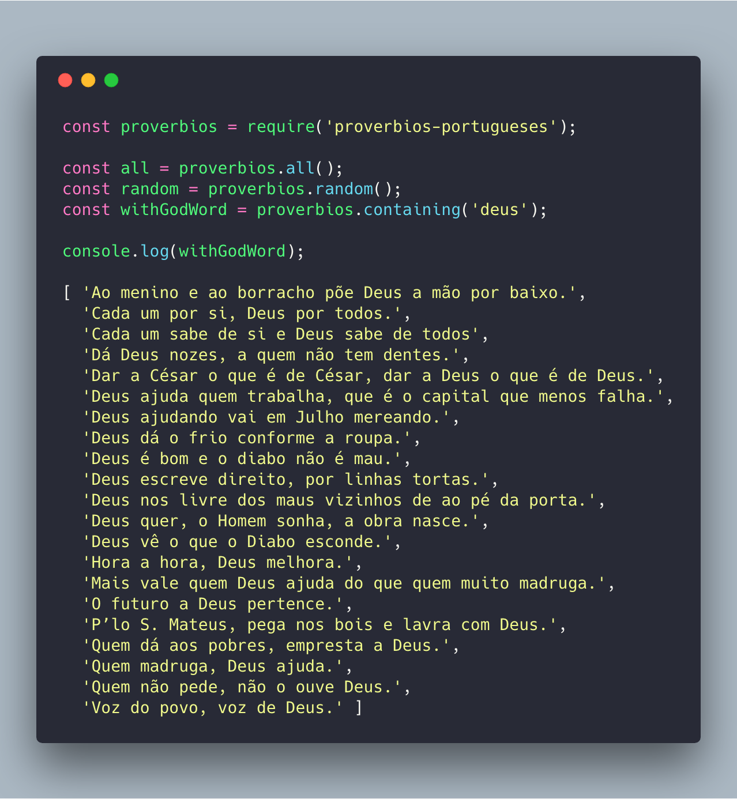

# Provérbios Populares Portugueses

Todos os provérbios populares portugueses.

[](https://travis-ci.org/AndreVarandas/proverbios-populares)[](https://codecov.io/gh/AndreVarandas/proverbios-populares)

### Usage
`$ npm install --save proverbios-portugueses`



```javascript
const proverbios = require('proverbios-portugueses');

const all = proverbios.all();
const random = proverbios.random();
const withGodWord = proverbios.containing('deus');
```

[MIT - André Varandas](LICENSE)
